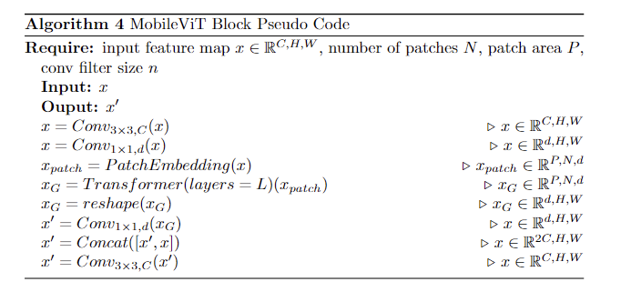
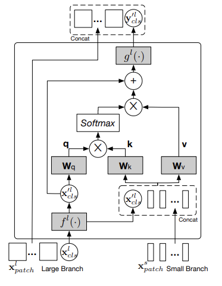

# Vision Transformer系列SOTA模型演进及其在MindCV最佳实践

在计算机视觉领域， 卷积神经网络（Convolutional Neural Network， CNN)是一种被广泛使用的网络结构。但是，随着self-attention结构在自然语言处理（Natural Language Processing, NLP) 任务上逐渐占据优势地位， Transformer这个在NLP领域大放异彩的模型，也终于进入了计算机视觉领域。 2020年10月，Google 的文章 An Image is Worth 16x16 Words: Transformers for Image Recognition at Scale 将Transformer运用到图像分类任务上，提出了Vision Transformer 模型，简称ViT。 

如果你还不太熟悉self-attention 以及Transformer， 可以阅读[这篇文章](https://zhuanlan.zhihu.com/p/345680792)。本文将主要介绍ViT系列模型结构的演进历史和各自的伪代码，以及如何将ViT运用到图像识别的实战例子。

本文的阅读时长大约15分钟。

* [ViT 系列模型结构演进历史](#first-sec)
    * [ViT](#1.1-subsec)
    * [ConViT](#1.2-subsec)
    * [MobileViT](#1.3-subsec)
    * [CrossViT](#1.4-subsec)
    * [PiT](#1.5-subsec)
    * [总结](#1.6-subsec)
* [ViT 实战](#second-sec)

## ViT 系列模型结构演进历史 
本文介绍的ViT系列模型包括ViT, ConViT, MobileViT, CrossViT以及PiT。除了ViT以外的其他模型，都或多或少地将Transformer和CNN的特点结合在一起，以期达到在视觉任务上的最佳效果。其中， ConViT和MobileNet的设计思路都是改进self-attention, 让其既能够关注全局的信息，又能对局部特征更加敏感。 CrossViT和PiT的设计重点更多放在了特征图的空间尺度上，如何让模型更好的学习多尺度的特征信息是要解决的核心问题。

接下来，我们对每一个模型的结构进行具体的介绍，并附上一些伪代码辅助理解。

### ViT 
ViT[1]的核心思想是像处理NLP任务中的sequence of tokens一样来处理图像信息：首先将图像分割成一个个的图像块，然后将图像块转换成向量， 最后用Transformer来处理向量的序列。

<em>
The architecture of ViT. Image source [1]. 
</em>

 
* Patch Embedding （图像块编码）

ViT的第一个步骤是**从输入的二维图像得到Patch Embedding的过程**。 Patch Embedding可以理解为视觉的“单词”。 得到Patch Embedding的过程是将2维图像的信息用一个由多个1维向量组成的序列来表达的过程。这是因为Transformer不能直接处理2维的图像输入。详细的过程如下。

首先我们要将2维图像均匀的分割成 $P\times P$ 大小的小块，总共分割成 $N$ 块。经过分割处理后的2维patches形状是 $(N, P^2, C)$ , 其中 $C$ 是图像的channel数量，通常为3（RGB图像）。经过flatten处理后， 2维patches 变为1维的序列，形状是 $(N, P^2\cdot C)$ 。

举例来说，当输入是一张 $224\times 224$ 的RGB图片时，如果分割出的图像块大小为 $16\times 16$ , 图像块的数量就是 $(224/16)^2=196$ 。经过flatten 后的输入变为 $(196, 768)$ ( $16\times 16\times 3 = 768$ )。

* Linear Projection （线性投射层）

接下来，我们将1维序列输入到**线性投射层**中。线性投射层可以将输入的向量们映射到一个固定的维度 $D$ 。 至此，我们已经从一张2维图像得到了由一个1维向量组成的序列 $(N, D)$ 。

* Class Token （类别编码）

除了Patch Embedding之外，ViT还使用了一个特殊的embedding $[cls]$ 与Patch Embedding连接在一起。 $[cls]$ embedding是可以学习的， 相当于一个全局的特征embedding，能够让Transformer encoder在 $[cls]$ 位置输出图像分类的结果。 因此，序列的长度从 $N$ 增加到 $N+1$ 。

* Positional Embedding （位置编码）

然后，我们需要**对Patch Embedding 添加位置信息**。ViT使用了NLP中Transformer常用的learnable 1D position embeddings （可学习的1维位置编码）。通过将position embedding和patch embedding相加，我们得到了添加位置信息的patch embedding。

* Transformer Layers 

接下来， ViT**使用Transformer对输入序列进行处理**。 ViT中的Transformer只包含encoder layers, 也就是 $L$ 层 `LayerNorm -> Multihead Self-Attention -> LayerNorm -> MLP`的堆叠。 这个过程可以利用Transformer的自注意力机制来学习图像中不同位置的信息之间的关系，从而提高对图像的理解能力。 Transformer encoder layers不会改变输入的形状大小，因此经过若干encoder layers之后，Transformer输出的形状大小为 $(N+1, D)$ . 

* Classification （分类）

ViT的最后步骤是**获取图像分类结果**。前面说到Transformer在 $[cls]$  embedding所在位置的输出，对应着图像分类的结果。通常 $[cls]$ embedding的位置是第一个。我们把经过L层encoder layers处理后的输出记为 $z_L$ , 那么 $z_L^0$ 就是位置为0的输出向量。最后ViT输出的图像分类结果由 $z_L^0$ 经过一层LayerNorm和一个多层的分类器得到：$\hat{y} = MLP(LN(z_L^0))$ 。

下图是一段ViT模型结构的伪代码：

<em>
The pseudo code of ViT. 
</em>

与CNN相比，ViT的显著特点是，在有足够多的数据进行预训练的前提下，ViT的表现能够超过CNN; 反之，ViT的表现则不如同等大小的ResNets。这是由于CNN的归纳偏置（主要是局部性和平移不变性）可以作为一种先验知识，让CNN只需要使用较少的训练数据就得到比较好的结果。

### ConViT 

为了缓解Transformer缺乏归纳偏置的问题，从而减少对预训练数据量的要求，Facebook在2021年提出的ConViT[2]首次将"软性归纳偏置"（soft inductive bias）引入到Transformer layer中。如原论文所说，这是为了“将CNN和Transformer两种模型的强项结合到一起，并且规避这两种模型的缺点”。

CNN的归纳偏置主要体现在两个方面： 局部连接和权值共享。前者使每一个输入神经元只跟输入周围的一小部分像素相连，保证了特征的局部性；后者使不同位置的特征被相同的权重处理，保证了平移不变性。这两个方面是以硬编码的形式体现在网络结构中的，但是这种硬编码的归纳偏置在处理长距离学习的问题上存在先天的劣势。Transformer在处理输入序列时，可以通过self-attention学习任意距离的两个输入之间的attention。 但是缺乏先验知识，在图像任务上，Transformer需要更多的预训练数据。

ConViT的作者提出的gated positional self-attention(GPSA)能够将CNN和Transformer的优势结合起来，既可以利用CNN的对局部特征的学习能力和采样效率，又能够利用Transformer对全局关系的学习能力和灵活性。GPSA通过在self-attention中引入一个门控参数，来调节对局部特征和全局信息的关注程度。

<em>
The architecture of ConViT (GPSA: gated positional self-attention; SA: self-attention). Image source [2]. 
</em>

ConViT整体的结构如上图的左半部分所示。 可以看到，ConViT只是将ViT的头几层encoder layer中的SA替换成了GPSA，并且修改了 $cls$ embedding与image patches 结合的位置。下面的伪代码展示了ConViT的计算过程。

<em>
The pseudo code of ConViT . 
</em>

接下来我们介绍GPSA layer的结构。GPSA的核心在于一个可学习的门控系数。

* Gating Paramater （门控系数）

$\lambda$ 是一个可学习的门控参数。 $\sigma(\lambda)$ 是经过sigmoid函数后的门控参数，将GPSA的计算分为左右两个分支。

* Left Branch （左分支）

左分支与原始的self-attention计算过程非常类似。$X_i$ 和 $X_j$ 分别对应`query`和`key`。 两者经过 $W_{qry}$ 和 $W_{key}$ 的映射得到 $Q_i = W_{qry}X_i$ 和 $W_j = W_{key}X_j$ 。 我们计算他们之间的点积并经过softmax函数计算attention weights, 等于 $softmax(Q_iW_j^T)$ 。

考虑到多头注意力的结构，第 $h$ 个head得到的attention weights就是 $softmax(Q_i^h(W_j^h)^T)$ 。

* Right Branch （右分支）

在右分支，作者使用了positional self-attention (PSA)[3]的结构， 其核心思想是在self-attention引入不同像素之间相对位置的信息。

$r_{ij}\in R^{D_{pos}}$ 编码的信息就是像素 $i$ 和像素 $j$ 的相对位置信息。在ConViT训练过程中，$r_{ij}$ 是固定不变的。

$v_{pos}^h \in R^{D_{pos}}$ 代表着第 $h$ 个head学到的相对位置query。在论文中， $D_{pos}$ 大小为3。通常 $D_{pos}<< D$ 这说明引入positional self-attention产生的多余计算量非常小，几乎可以忽略。在右分支部分，第 $h$ 个head得到的positional attention weights就是 $softmax((v_{pos}^h)^T r_{ij})$ 。

* Fusion （结合）

最后，通过门控参数 $\lambda$ 将两部分attention weights 结合起来, 得到

$A_{ij} = (1-\sigma(\lambda))softmax(Q_i^h(W_j^h)^T) + \sigma(\lambda)softmax((v_{pos}^h)^T r_{ij})$。

某一层GPSA layer的输出结果应该是：

$GPSA^h(X) := normalize(A^h)XW^T_{val}$, 

其中 $W_{val}$ 表示value 的映射矩阵。

<em>
The pseudo code of GPSA layer. 
</em>

### MobileViT  

2021年， 苹果公司提出MobileViT。 这是一种结合了CNN优点（例如空间归纳偏置）和Transformer优点（例如输入自适应加权和全局处理）的轻量级网络结构，能够在移动端设备运行并取得超过（同样数量的参数）MobileNetv3的效果。

前面提到, CNN的卷积滤波器设计在长距离学习的任务上存在着先天的劣势，但是self-attention擅长学习全局信息。因此作者提出了一种混合了CNN卷积滤波器和self-attention的特殊结构，称为MobileViT Block.

<em>
The architecture of MobileViT and MobileViT Block. Image source [3]. 
</em>

* Conv Filters （卷积滤波器）

MobileViT Block首先用 $n\times n$ 的卷积滤波器学习局部的信息，再用 $1\times 1$ 的卷积滤波器将特征维度投射到 $d$ 。 

* Patch Embedding （图像块编码）

在特征图上分割出一共 $N$ 个image patches, 每一个的大小为 $P$ (注意前文中的 $P$ 表示image patch 的长或者宽，这里的 $P$ 表示面积), 特征维度为 $d$ ，经过展开得到 $(P, N, d)$ 的特征 $X_U$ 。其中每一个像素点位置 $p$ 对应的特征 $X_U(p)\in R^{N\times d}$ 。

* Transformer

将 $X_U(p)$ 输入到Transformer可以学习关于N个image patches在 $p$ 位置的全局信息:

$X_G(p) = Transformer(X_U(p)), 1\leq p \leq P$.

这一个过程正如下图所示。以每一个image patch的中心像素为例，通过Transformer可以学习到其他所有image patches在中心位置的全局信息（黄色箭头），而每一个中心位置的像素已经通过之前的卷积滤波器学到了周围像素的局部信息。如此一来，就实现了局部信息和全局信息的共同学习。

<em>
Every pixel sees every other pixel in the MobileViT block. Image source [3]. 
</em>

* Reverse Operations （反向操作）

经过Transformer学习之后，将特征折叠成原来的形状，并经过 $1\times 1$ conv $-> concat -> n\times n $ conv 输出与原特征图形状一样的特征。

由于MobileViT的整体结构比较类似于MoibleNet,都是Block的连续叠加。这里的伪代码只展示了MobileViT Block的计算过程。

<em>
 The pseudo code of MobileViT Block
</em>

### CrossViT 

MIT 在2021年提出的CorssViT 针对的是ViT如何学习多尺度图像特征的问题。 为了适应不同尺度的物体， CrossViT采取了双分支结构，可以分别处理较小尺寸的image patches和较大尺寸的image patches。在两个分支的encoder layers对不同尺度的image patches处理完以后，再通过cross-attention layers进行信息融合。具体的模型结构如下图所示：

<em>
The architecture of CrossViT. Image source [5]. 
</em>

CrossViT的主要贡献在于cross-attention layer的设计。作者希望融合多尺度特征的信息，但是要避免将特征简单拼接起来造成计算量过大。$cls$ 这个特殊的embedding某种程度上代表了全局特征（因为可以据此得到class prediction）, 所以作者提出，将某一个分支的 $cls$ embedding与另一个分支的patches embedding做cross-attention就能融合两个分支的信息。 这样做的好处是没有造成特征维度的增加，因此节省了计算量。

<em>
The architecture of CrossViT cross-attention layer for the Large Branch. Image source [5]. 
</em>

上图展示的是较大尺寸的image patches对应的分支（记为Large Branch）中的cross-attention layer。 如前所述，将Large Branch的 $cls$ embedding与另一个分支(Small Branch)的patch embedding做cross-attention能够融合这两个分支的信息。具体过程如下：

* query

提取Large Branch 中的cls embedding, 经过维度转换函数 $f^l(\cdot)$ 得到 $x^{l \prime}_{cls}$ 。$x^{l \prime}_{cls}$ 与 $W_q$ 计算乘积得到cross-attention 中的query:

$q = W_q x^{l \prime}_{cls}$

* key and value 

$x^{l \prime}_{cls}$ 与来自Small Branch的patch emebdding拼接在一起，分别于 $W_k$ 和 $W_v$ 计算乘积, 得到cross-attention 的key $k = Concat[x^{l \prime}_{cls}, x^s_{patch}]$ 和value (与 $k$ 相同).

* cross-attention output

cross-attention 计算的是query与key之间的attention，首先得到的是attention weights:

$A = softmax(q^Tk/\sqrt(C))$

将attention weights与 value相乘，得到cross-attention layer的输出为 $Av$ 。 
* Residual Shortcut

这里的residual shortcut将cross-attention的输入与它的输出相加，得到 $y^{l }_{cls} = x^{l \prime}_{cls} + Av$ .

* Input to the next cross-attention layer （下一层cross-attention layer的输入）

$y^{l }_{cls}$ 还要经过另一个维度转换函数 $g^l(\cdot)$ ， 得到 $y^{l \prime}_{cls} = g^l(y^{l }_{cls})$ ， 从而保证其特征维度与 $x^{l}_{patch}$ 特征维度的一致性。$y^{l \prime}_{cls}$ 与Large Branch的patch embedding结合在一起还可以作为下一层cross-attention layer的输入，持续处理两个分支的信息融合。

<em>
The pseudo code of CrossViT cross-attention layer . 
</em>

### PiT 

Pooling-based ViT （PiT）针对的问题同样是图像（或者是feature map）的尺寸问题。不同于CrossViT采取双分支的方式来处理两种不同尺度的输入，PiT的策略与CNN类似，都是从一个较大尺寸的图像出发，渐进地缩小其空间尺寸并且增大特征维度。如原文所说，这样做的好处是能够增加模型的表达能力和泛化能力(expressiveness and generalization)。

<em>
The dimension configuration of ResNet50, ViT, and PiT. Image source [6]. 
</em>

ResNet50 由若干个卷积模块组成，每一个模块都会将特征图的空间尺寸缩小并将特征维度增加。但是，ViT从得到image patches (形状是 $(N, P^2\times C)$ ，$P$ 在图中等于14，$C$ 在图中等于384)， 代表着空间尺寸的 $P^2$ 不会随着self-attention layer的数量增加而变化。同样的， 特征维度 $C$ 也不会随着self-attention layer的数量增加而变化。

PiT 设计了由几层self-attention layer构成的block。每一个block能将输入特征的空间尺寸减半，将输入特征的维度增加到两倍。$cls$ embedding的维度也相应地增加，保证其与patch embedding的维度能够对齐。这样的操作是通过每一个block中的Pooling layer 来完成的。

<em>
The pooling layer of PiT. Image source [6]. 
</em>

PiT的pooling layer首先将输入特征由 $(N， P^2\times C)$ 的一维特征reshape成为 $(N, P, P, C)$ 的三维特征。在这之后，可以使用depth-wise convolution将特征图的空间尺寸缩小，将其特征维度增大。

### 总结 

在下面的表格中，我们对这几个模型的特点和在ImageNet-1K上的精度进行了总结：

| 模型  | 链接 | Top-1 (%) | Top-5 (%) | Params (M) | 特点 |
|-------|------|-----------|-----------|------------|-----|
| ViT ([vit_l_32_224](https://github.com/mindspore-lab/mindcv/tree/main/configs/vit))  | [paper](https://arxiv.org/abs/2010.11929) | 73.71 |	90.92|	305.52| 从image patches构建序列，输入Transformer Encoder学习image patches之间的联系|
| ConViT ([convit_base_plus](https://github.com/mindspore-lab/mindcv/tree/main/configs/convit))| [paper](https://arxiv.org/abs/2103.10697)| 81.96| 95.04 | 153.13|  在self-attention中引入一个门控参数，来调节对局部特征和全局信息的关注程度|
| MobileViT ([mobilevit_small](https://github.com/mindspore-lab/mindcv/tree/main/configs/mobilevit))| [paper](https://arxiv.org/pdf/2110.02178.pdf)|78.47| 94.18| 5.59| MobileViT Block 实现了卷积滤波器与Transformer 的结合|
| CrossViT ([crossvit_18](https://github.com/mindspore-lab/mindcv/tree/main/configs/crossvit)) | [paper](https://arxiv.org/abs/2103.14899) |81.93|95.75|43.27 | 使用Small和Large两个分支来处理两个不同尺度的image patches|
| PiT ([PiT_b](https://github.com/mindspore-lab/mindcv/tree/main/configs/pit)) | [paper](https://arxiv.org/abs/2103.16302v2)|  81.87	| 95.04	| 73.76| 使特征图的空间尺度随着Transformer Layer层数增加而渐进减小|

从表格中不同模型的精度和权重数量对比结果，我们不难看出，**利用卷积滤波器的特性**或者**多尺度特征图融合**是提升精度和降低模型大小的关键。

[1]: Dosovitskiy, A., Beyer, L., Kolesnikov, A., Weissenborn, D., Zhai, X., Unterthiner, T., Dehghani, M., Minderer, M., Heigold, G., Gelly, S., Uszkoreit, J., & Houlsby, N. (2020). An Image is Worth 16x16 Words: Transformers for Image Recognition at Scale. ArXiv, abs/2010.11929.

[2]: d'Ascoli, S., Touvron, H., Leavitt, M.L., Morcos, A.S., Biroli, G., & Sagun, L. (2021). ConViT: improving vision transformers with soft convolutional inductive biases. Journal of Statistical Mechanics: Theory and Experiment, 2022.

[3]: Mehta, S., & Rastegari, M. (2021). MobileViT: Light-weight, General-purpose, and Mobile-friendly Vision Transformer. ArXiv, abs/2110.02178.

[4]: Ramachandran, P., Parmar, N., Vaswani, A., Bello, I., Levskaya, A., & Shlens, J. (2019). Stand-Alone Self-Attention in Vision Models. ArXiv, abs/1906.05909.

[5]: Chen, C., Fan, Q., & Panda, R. (2021). CrossViT: Cross-Attention Multi-Scale Vision Transformer for Image Classification. 2021 IEEE/CVF International Conference on Computer Vision (ICCV), 347-356.

[6]: Heo, B., Yun, S., Han, D., Chun, S., Choe, J., & Oh, S. (2021). Rethinking Spatial Dimensions of Vision Transformers. 2021 IEEE/CVF International Conference on Computer Vision (ICCV), 11916-11925.

## ViT 实战 

接下来，我们使用MindCV进行ViT图片分类的实战练习。实战练习的文档参考[这里](./ViT_image_classification_tutorial.ipynb)。

